# 智慧景区票务与游客流量监测系统

<p align="center">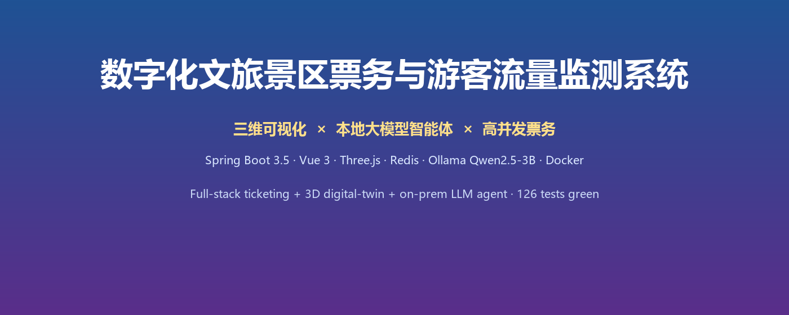</p>

<p align="center">
  <a href="https://github.com/sisa-q/scenic-system/actions"></a>
  
  
  
  
  
  
</p>


> **🚀 一个能跑、能演示、能答辩的智慧景区全栈方案：三维可视化 × 本地大模型智能体 × 高并发票务**
> **Full-stack ticketing + Three.js 3D digital-twin + on-prem LLM agent (Qwen2.5-3B) · 126 tests green · Docker one-click**

一个**真实可运行、可演示、带第三方支付闭环**的全栈系统：游客在 Web / PWA / 安卓 App 上选景点买票、支付宝支付、扫码核销入园；管理员在后台维护票务、实时查看客流数字孪生大屏。


## 🏗 架构一览

| 总体技术架构 | 多智能体协同 |
|---|---|
| 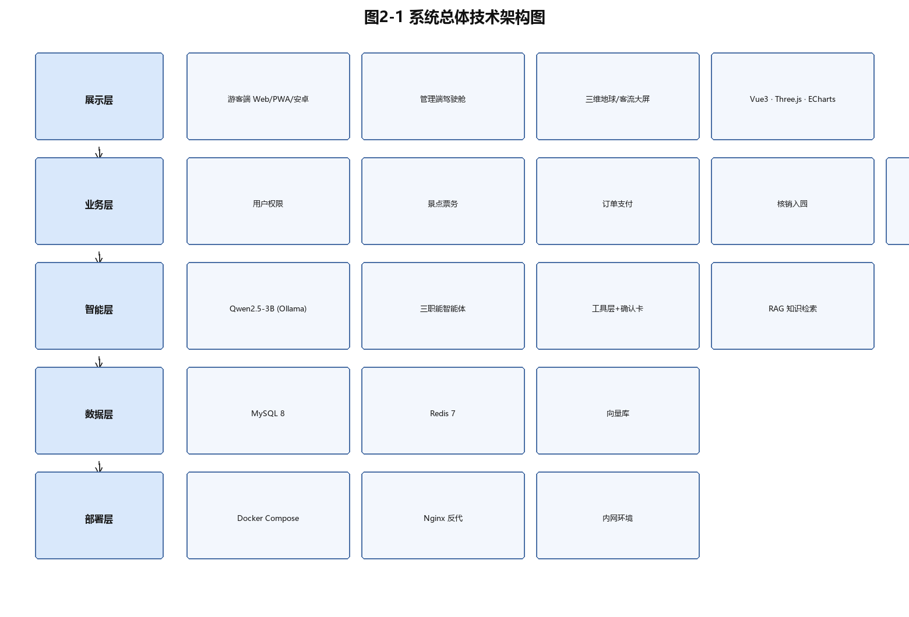 | 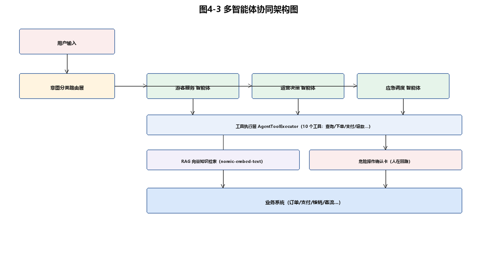 |

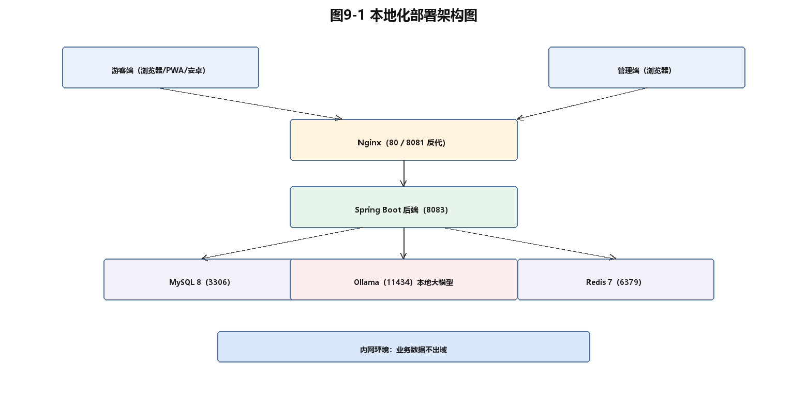


## 📸 界面预览

<p align="center">
  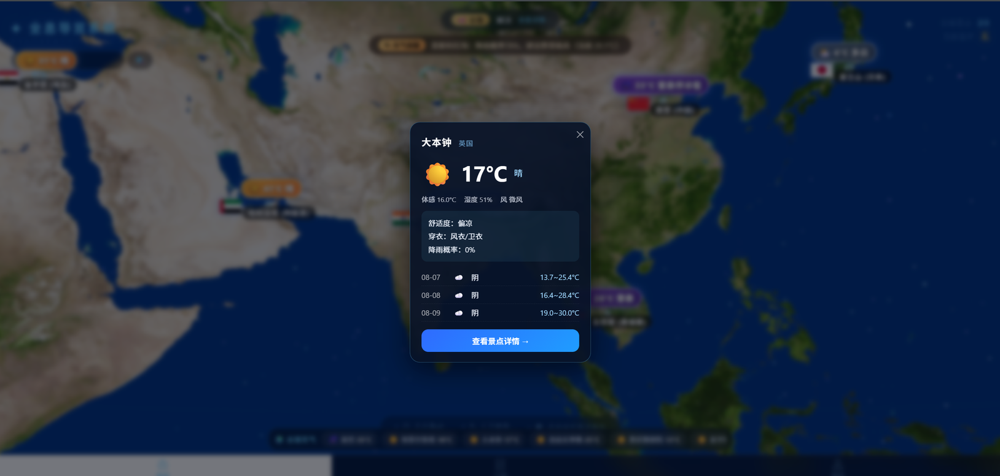
  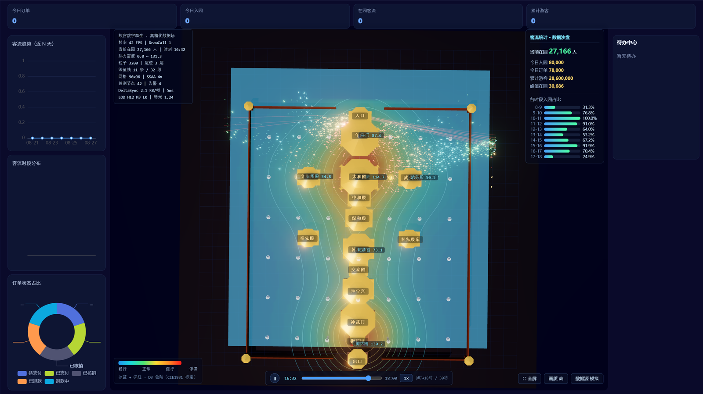
  
  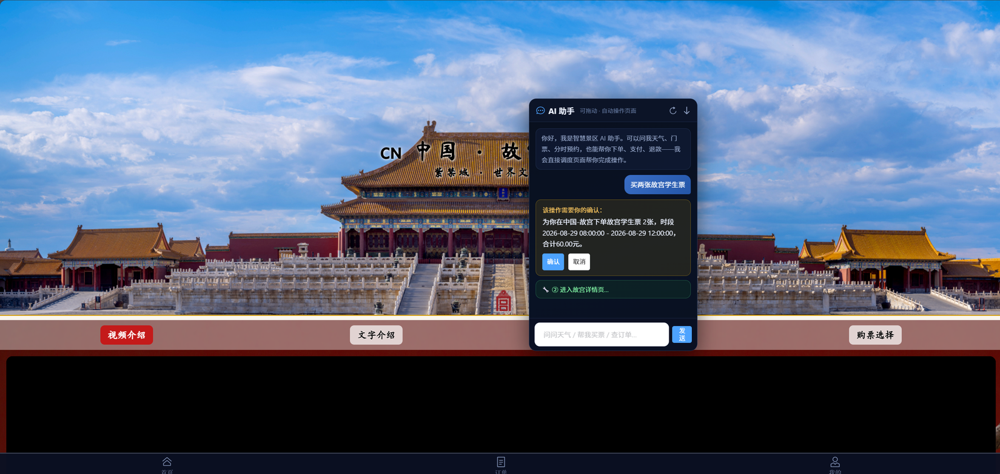
  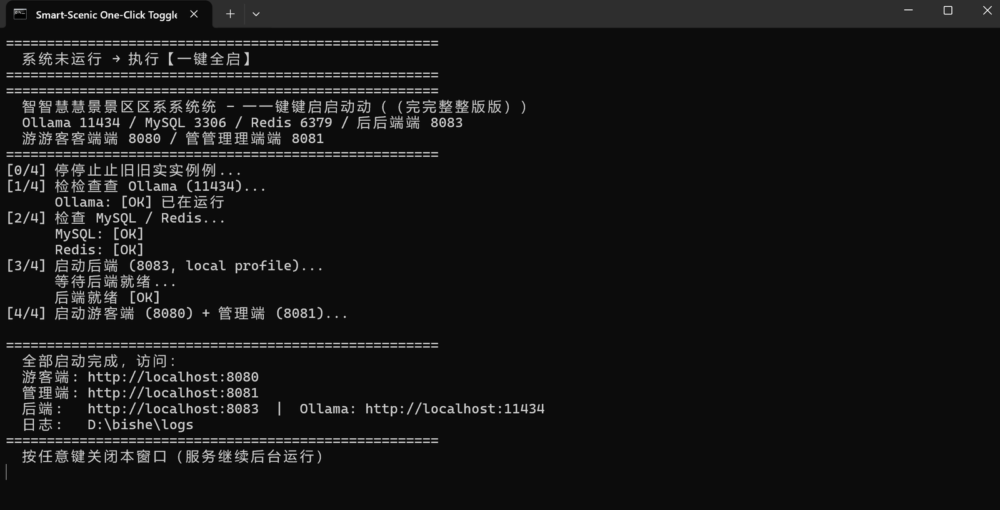
  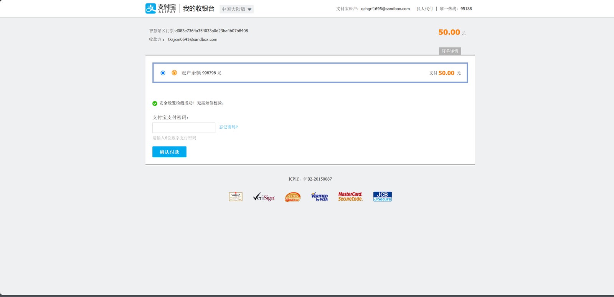
  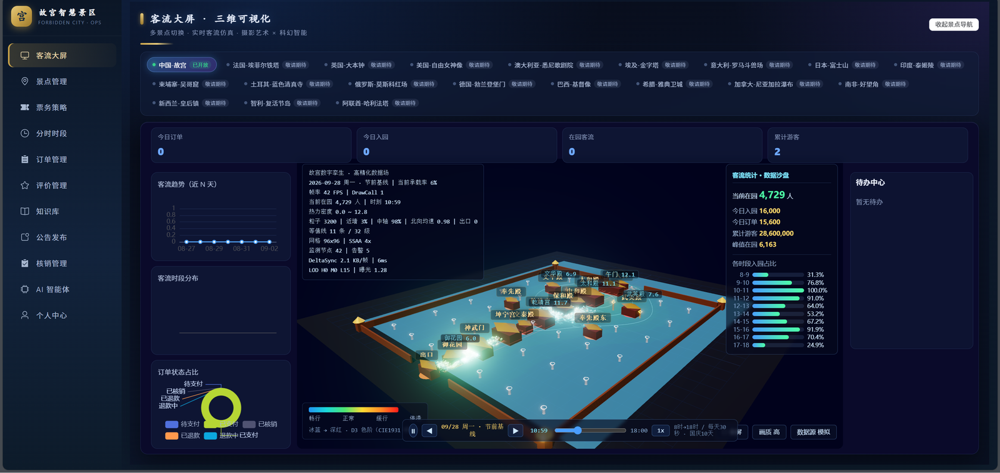
  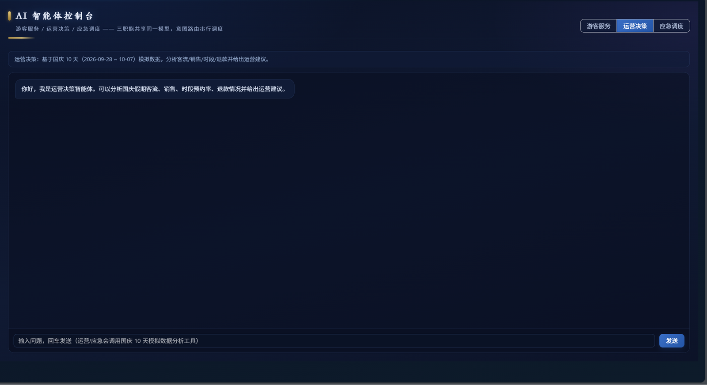
  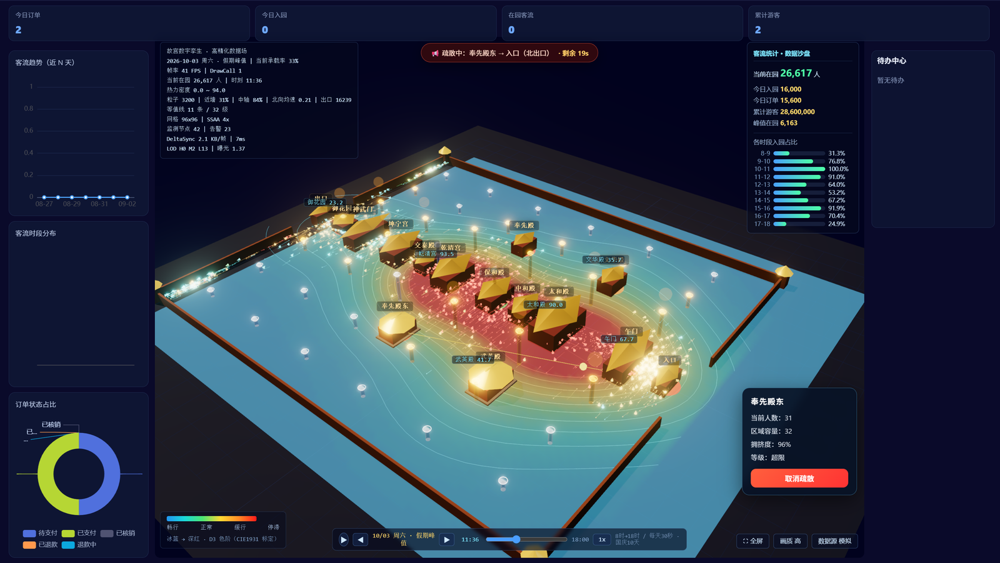
</p>
<p align="center">
  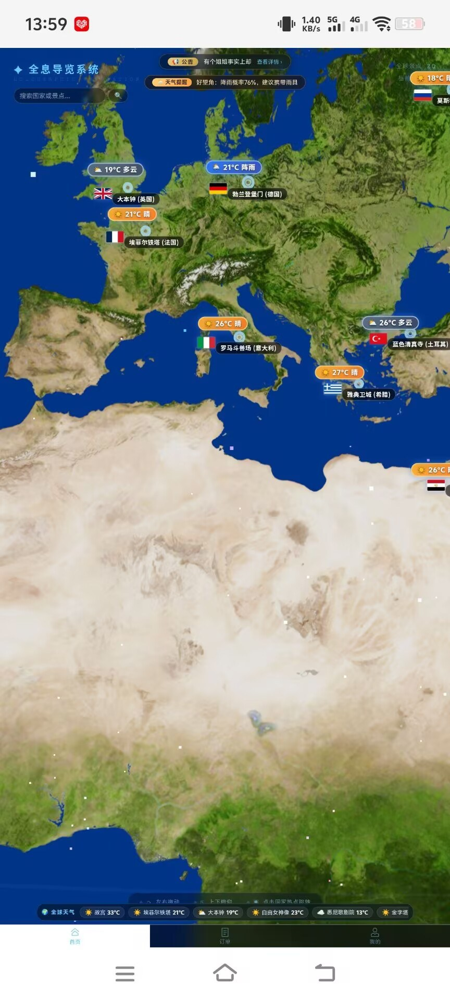
</p>

## ✨ 核心亮点

- **🧠 本地大模型智能体（核心差异化）**：Ollama 本地部署 Qwen2.5-3B（数据不出内网）；意图路由分发**游客服务 / 运营决策 / 应急调度**三类智能体；Function Calling 调用 **10 个工具**（查票/下单/支付/退款…）；RAG 知识库检索降低幻觉；危险操作**确认卡 = 人在回路**；AI 悬浮窗支持**四步自动购票链**过程可视化
- **支付宝沙箱真实支付**：自研 RSA2 签名/验签、异步回调幂等、金额校验、支付超时失效（`AlipaySigner`）
- **Redis 防超卖 + 缓存三防**：分布式锁（`setIfAbsent`）+ 数据库双重校验；防穿透/击穿/雪崩（`RedisCache`），Redis 不可用自动降级
- **PWA 升级**：Service Worker + Workbox 分层缓存（预缓存 / 图片 CacheFirst / 读接口 NetworkFirst / 写接口不缓存），手机可安装、可离线
- **客流数字孪生大屏**：Three.js 程序化建模故宫 15 座殿宇 + 3200 粒子速度场 + Marching Squares 热力场，WebSocket 每 5 秒实时推送
- **3D 地球全息导览**：8K 地球 + 全球景点 CSS2D 标注 + 实时天气面板 + 异常天气 WebSocket 预警（天气三级降级：open-meteo → 和风 → 模拟）
- **订单状态机**：待支付 → 已支付 → 已核销 / 已退款 / 已失效 / 退款申请中，六态流转 + 支付超时自动失效
- **多端交付**：Web（Vue3+Vant）+ PWA（可安装离线）+ 安卓 App（uni-app 壳）+ Docker Compose 一键部署

## 🎓 大模型微调数据

面向本地智能体整理并训练了 **127 条**景区业务指令数据（JSONL：instruction / input / output）：

| 任务类型 | 条数 | 说明 |
|---|---|---|
| 意图分类 | 59 | 退款 / 查票 / 改期 / 闲聊 / FAQ |
| 直接问答 | 32 | 真实景区问题 |
| 业务咨询 | 12 | 退票 / 改期 / 预约规则 |
| 票务信息回答 | 10 | 按票种 / 时段组织回答 |
| 知识库问答 | 9 | 开放时间 / 交通 / 展馆 |
| 寒暄 | 5 | 非业务友好回复 |

- 📄 **完整逐条展示（127条）**：[docs/finetune-dataset.md](docs/finetune-dataset.md)
- 📦 **原始数据 JSONL**：[docs/dataset/ticket_agent_train.jsonl](docs/dataset/ticket_agent_train.jsonl)
- 微调采用 **QLoRA（4bit）**；因微调模型与工具调用的兼容性验证，最终由 base 模型承载工具链（完整工程取舍见论文第 6 章）

## 🛠 技术栈

| 端 | 技术 |
|---|---|
| 游客端前端 | Vue 3 · Vant 4 · Pinia · Vue Router · Axios · Three.js · PWA(Workbox) |
| 管理端前端 | Vue 3 · Element Plus · Pinia · Vue Router · Axios · Three.js |
| 后端 | Spring Boot 3.5 · Java 21 · Spring Data JPA · Spring WebSocket · Redis(Lettuce) · JWT · BCrypt |
| 数据/中间件 | MySQL 8 · Redis 7 · Nginx |
| 测试/部署 | JUnit5 + H2 + JaCoCo · Docker Compose（MySQL/Redis/后端/Nginx 四容器） |

## 🏗 架构

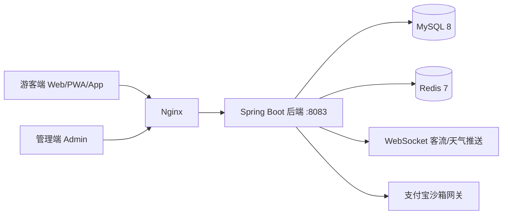

## 📁 目录结构

```
├─ houduana/     Spring Boot 后端（Controller/Service/Repository/Entity/config/util/vo）
├─ web/          游客端前端（Vue3 + Vant + Three.js + PWA）
├─ admin/        管理端前端（Vue3 + Element Plus）
├─ scenic-android/ uni-app 安卓壳（web-view 加载游客端）
├─ deploy/       Docker/Nginx/一键部署脚本
├─ docs/         设计文档
└─ docker-compose.yml  一键编排 MySQL8+Redis7+后端+Nginx
```

## 🚀 快速开始

### 本地开发
```bash
# 1. 启动后端（必须带 local profile，加载本地配置）
cd houduana
mvn spring-boot:run -Dspring-boot.run.profiles=local

# 2. 启动游客端（8080）
cd web && npm install && npm run serve

# 3. 启动管理端（8081）
cd admin && npm install && npm run serve
```

### Docker 一键部署
```bash
cd deploy && ./build-and-up.ps1
# 游客端 http://localhost / 管理端 http://localhost:8081
```

### 测试
```bash
cd houduana && mvn test   # 118 项单元/集成测试 + JaCoCo 覆盖率
```

## 🔐 安全说明

- 数据库密码、JWT 密钥、支付宝私钥等**不入库**：`application.yml` 使用 `${ENV}` 占位，真实凭据在本地 `application-local.yml`（已被 .gitignore 忽略）
- 前端 `.env` 已被忽略，部署时按 `deploy/.env.example` 配置

## 📌 提交亮点

- `security` 密钥环境变量化（不入库）
- `feat` PWA 升级（Service Worker + Manifest + 手机可安装）
- `feat` 支付宝沙箱支付 + 网关迁移
- `feat` Redis 降级容错
- `fix` 视频弹窗/支付页返回交互

## 👤 关于

毕业设计 · 2027 届软件工程 · 全栈方向（Java 后端 + Vue 前端 + 三维可视化）