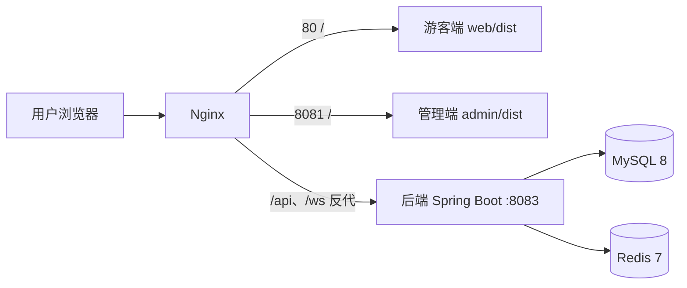

# 系统部署（Docker + Nginx + 生产配置）

本文档对应论文「系统部署」章节，提供一键容器化部署方案。

## 一、部署拓扑



- 游客端：`http://<服务器IP>`（80 端口）
- 管理端：`http://<服务器IP>:8081`
- 后端：`http://<服务器IP>:8083`（`/api/**`、`/ws/flow` 由 Nginx 反代）

## 二、目录结构

| 文件 | 作用 |
|---|---|
| `docker-compose.yml` | 一键编排：mysql + redis + backend + nginx |
| `houduana/Dockerfile` | 后端多阶段镜像（Maven 3.9 + JDK21 构建，JRE 运行） |
| `houduana/src/main/resources/application-prod.yml` | 生产配置，全部敏感值走环境变量 |
| `deploy/nginx/nginx.conf` | Nginx：托管两个 dist + `/api`、`/ws` 反代 |
| `deploy/nginx/Dockerfile` | Nginx 镜像（复制 web/dist、admin/dist） |
| `deploy/build-and-up.ps1` | 一键脚本：构建 dist → compose build → up |
| `deploy/.env.example` | 环境变量模板（复制为根目录 `.env`） |

## 三、部署步骤

### 1. 前置条件
- 安装并启动 Docker Desktop
- Node.js 可用（用于本地构建前端 dist；后端在 Docker 内自动构建）

### 2. 一键部署
```powershell
# 在仓库根目录执行
.\deploy\build-and-up.ps1
```

等价手动步骤：

```powershell
# 1) 构建两个前端
cd web;  npm run build
cd admin; npm run build

# 2) （可选）按需修改生产配置
copy deploy\.env.example .env

# 3) 构建并启动
docker compose up -d --build
```

### 3. 验证
```powershell
docker compose ps                 # 4 个服务全部 Up (healthy)
docker compose logs -f backend    # 看 Spring Boot 启动日志
```
- 打开 `http://localhost` → 游客端
- 打开 `http://localhost:8081` → 管理端

## 四、生产环境变量

| 变量 | 默认值 | 说明 |
|---|---|---|
| `MYSQL_ROOT_PASSWORD` | `REDACTED` | MySQL root 密码 |
| `MYSQL_PASSWORD` | `REDACTED` | 业务账号 scenic 的密码 |
| `JWT_SECRET` | 开发默认串 | 生产必须更换为 64 位随机串 |
| `MYSQL_HOST_PORT` / `REDIS_HOST_PORT` / `BACKEND_HOST_PORT` | 3306/6379/8083 | 宿主机端口映射，被占用时修改 |

> 首次启动 MySQL 数据卷为空，后端 `ddl-auto: update` 会自动建表；数据持久化在 `mysql_data`、`redis_data` 卷中。

## 五、本次改造的 4 个部署问题（对照）

| 原问题 | 本次解决 |
|---|---|
| 配置硬编码（MySQL 密码、JWT、localhost） | 新增 `application-prod.yml`，全部 `${ENV}` 占位，compose 注入 |
| 无部署编排 | 新增 `docker-compose.yml`（mysql + redis + backend + nginx） |
| 前端靠 dev server 运行 | Nginx 托管 `web/dist`、`admin/dist`，`/api`、`/ws` 反代后端 |
| WebSocket 硬编码 `ws://localhost` | 前端改为同源自动推导（`location.host + /ws/flow`），任意 IP/域名可直接访问 |

## 六、开发环境与生产环境差异

| 项 | 开发 | 生产 |
|---|---|---|
| 前端 | `npm run serve`（8080/8081，dev proxy） | Nginx 托管 dist（80/8081） |
| 后端 | IntelliJ 直接运行（8083） | Docker 镜像（8083） |
| 数据库 | 本机 MySQL | 容器 MySQL（独立数据卷） |
| 配置 | `application.yml` | `application-prod.yml`（环境变量覆盖） |
| WebSocket | dev proxy `ws: true` 转发 | Nginx `Upgrade` 头转发 |

## 七、实测记录（2026-08-06 已验证）

在 Windows + Docker Desktop 29.4.1 环境实测通过：

| 验证项 | 结果 |
|---|---|
| `docker compose up -d --build` | ✅ 4 个容器全部启动（mysql/redis healthy） |
| 游客端 `http://localhost` | ✅ 200 |
| 管理端 `http://localhost:8082` | ✅ 200 |
| API 经 Nginx 反代 `/api/spot/list` | ✅ 200，返回真实种子数据（DataInitializer） |
| WebSocket `/ws/flow`（经 Nginx Upgrade 转发） | ✅ 101，后端每 5 秒推送实时客流帧 |

**国内网络注意事项**：Docker Hub 直连超时，需在根目录 `.env` 配置镜像源覆盖（见 `.env.example`），实测 `docker.m.daocloud.io` 可用。

**端口冲突时**：本机开发环境若占用 80/8081/3306/8083，可在 `.env` 中通过 `ADMIN_HOST_PORT`、`MYSQL_HOST_PORT`、`BACKEND_HOST_PORT` 改映射（本次实测即用 8082/3307/8084）。