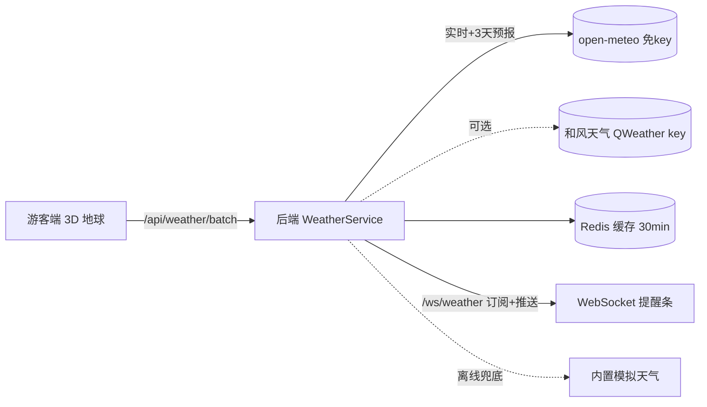

# 游客端首页 3D 地球云层 + 景点天气预报分析与推送 —— 功能方案

## 一、功能目标
在游客端首页全息导览（3D 地球）上：
1. 增加**云层**：半透明云层贴图球壳，绕地球缓慢自转，增强立体真实感；
2. 每个景点标记上方显示**实时天气**（图标 + 温度）；
3. 点击景点弹出**天气分析面板**：当前天气、体感、湿度、风力、舒适度、穿衣建议、降雨概率、3 天预报；
4. **天气提醒推送**：检测到降雨 / 高温 / 严寒 / 强对流时，通过 WebSocket 推送到游客端顶部提醒条。

## 二、总体架构

## 三、数据源与降级策略
| 优先级 | 数据源 | 说明 |
|---|---|---|
| 1 | open-meteo | 免费、免 key、全球，按经纬度查询实时 + 3 天预报 |
| 2 | 和风天气 QWeather | 可选，配置 `QWEATHER_KEY` 后启用（当前 key 未激活时自动跳过） |
| 3 | 内置模拟 | 离线/接口异常时兜底，保证演示不断 |

所有结果缓存 Redis（TTL 30 分钟），Redis 不可用时降级直查，不影响功能。

## 四、天气分析规则（WeatherServiceImpl）
- 舒适度：<0 严寒 / <10 寒冷 / <18 偏凉 / <26 舒适 / <32 偏热 / <38 炎热 / ≥38 酷热
- 穿衣建议：按温度分 5 档（厚羽绒服 → 短袖）
- 提醒（alert）：高温≥38、严寒≤-10、雷/雪、降雨概率≥70% 建议带伞、≥50% 备伞

## 五、推送机制
- 游客端连接 `/ws/weather` 并发送 `{type:'subscribe', points:[景点经纬度]}`
- 后端每 30 分钟（`@Scheduled`）检测订阅景点天气 → 生成提醒列表 → 推送 `{type:'weather_alerts', alerts:[...]}`
- 游客端顶部「🌦 天气提醒」滚动展示

## 六、新增/修改文件
### 后端（houduana）
| 文件 | 说明 |
|---|---|
| `vo/WeatherPoint.java` / `vo/WeatherForecast.java` / `vo/WeatherVO.java` | 天气数据结构 |
| `service/WeatherService.java` + `service/impl/WeatherServiceImpl.java` | 数据源获取 + 分析规则 + Redis 缓存 |
| `controller/WeatherController.java` | `/api/weather/now`、`/api/weather/batch` |
| `config/WeatherWebSocketHandler.java` | `/ws/weather` 订阅 + 定时推送 |
| `config/WebSocketConfig.java` | 注册 `/ws/weather` |
| `config/WebConfig.java` | 放行 `/api/weather/**`（公开） |
| `application.yml` / `application-prod.yml` | `weather.qweather-key` 配置 |

### 前端（web）
| 文件 | 说明 |
|---|---|
| `src/api/weather.js` | 天气 API |
| `src/views/web/Home.vue` | 云层球壳 + 天气标签 + 天气面板 + 提醒条 + 云层开关 |

### 部署
| 文件 | 说明 |
|---|---|
| `docker-compose.yml` | backend 增加 `QWEATHER_KEY` 环境变量 |
| `.env` | `QWEATHER_KEY`（可选） |

## 七、验证
- 后端：`mvn compile` 通过；接口 `/api/weather/batch` 返回各景点天气+分析
- 前端：`npm run build` 通过；浏览器打开游客端首页可见云层与天气标签
- 推送：连接 `/ws/weather` 订阅后收到 `weather_alerts`

## 八、演示要点（答辩）
1. 3D 数字地球 + 动态云层 → 展示前端三维可视化能力
2. 点击任意国家景点 → 实时天气 + 穿衣/舒适度分析 → 展示"文旅 + 气象"业务融合
3. 降雨/高温自动提醒推送 → 展示 WebSocket 实时推送能力